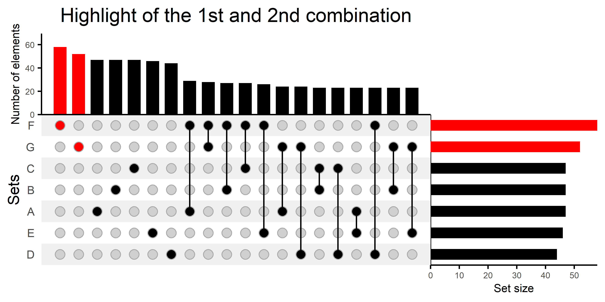
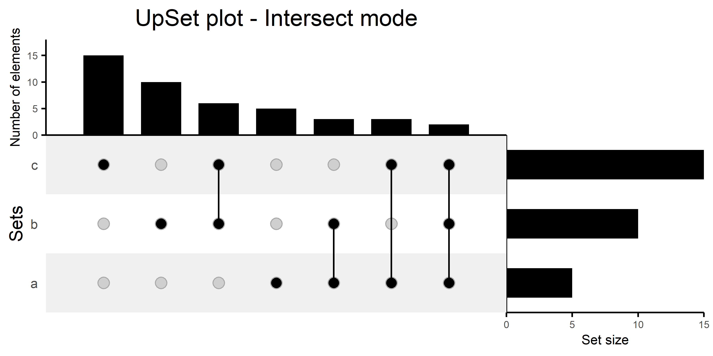
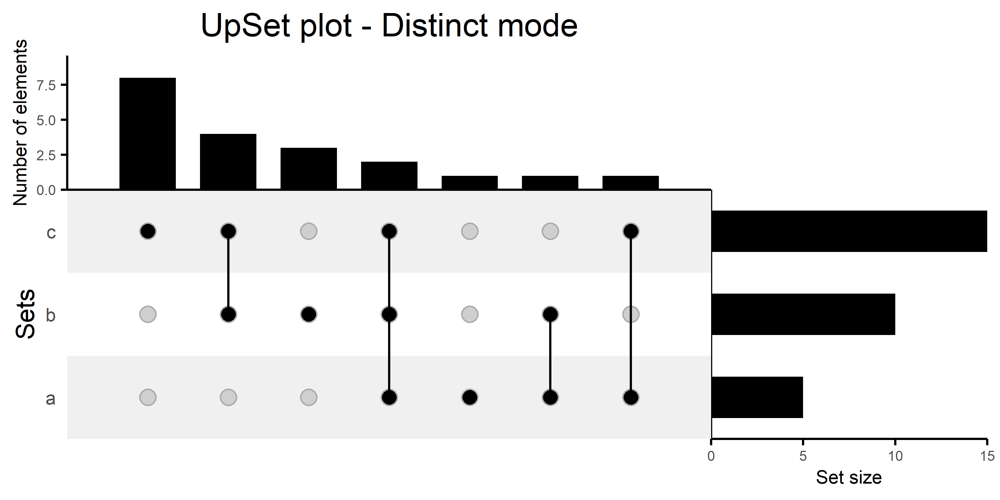
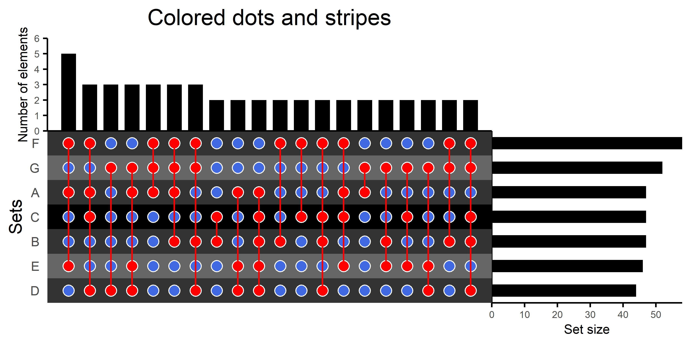
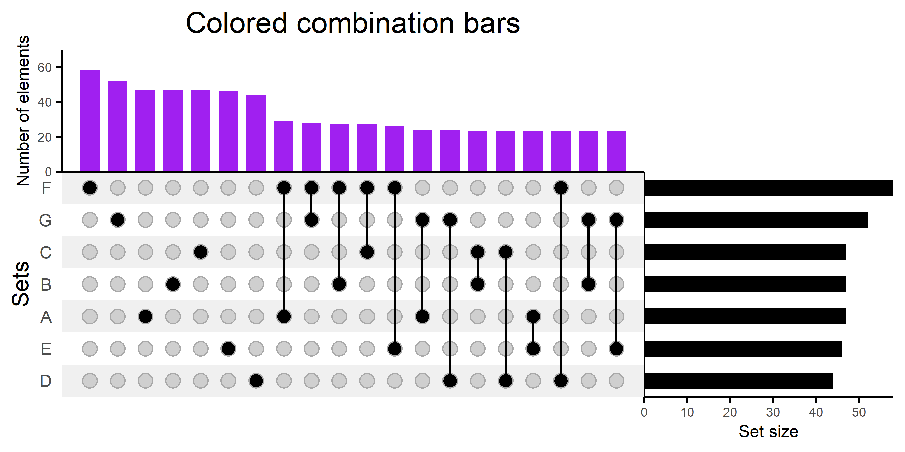

### The UpSetColor package

## Showcase



## How it compares to other packages?

There exist other packages to generate UpSet visualizations:
* **[UpSetR](https://github.com/cran/UpSetR/blob/master/R/upset.R)** is a powerful tool and the pioneer in the UpSet visualisations, but it was not designed to be extended with ggplot components and the repository is no longer active
* **[ggupset](https://github.com/const-ae/ggupset)** uses scales to convert a single plot to upsets plots, e.g. with scale_x_upset - a really nice approach, recommended for simple ggplot. However, as it uses ggplot notation, code is lengthty.
* **[ComplexHeatmap](https://jokergoo.github.io/ComplexHeatmap-reference/book/upset-plot.html)** also offers a way to generate UpSet plots but it is not ggplot2-centered.
* **[complex-upset](https://github.com/krassowski/complex-upset)** allows generating UpSet plots with ggplot components. It is a useful package for advanced UpSet representations, but package sintax, combining both ggplot and and non-ggplot sintax, can be confusing.

Although all these packages allow generating UpSet visualizations, some are not compatible with ggplot or have limited functionality. Besides generating customized plots, **UpSetColor** allows retrieving the data frames used to build the plots in the UpSet visualization. So, plot customization can go as far as the user's knowledge of ggplot.

## Installing UpSetColor

The package can be installed with devtools:

```{r install}

  if (!require("devtools")) install.packages("devtools")
  library("devtools")
  install_github("f-puig/UpSetColor")
  
  # Load UpSetColor
  library("UpSetColor")

```

## Starting with UpSetColor

The only function in the package is **UpSetColor**. This functions accept three types of data:
A list of sets (set of the list of sets is a vector), a binary matrix or a binary data frame. For the last two, the elements are in the rows and the sets in the columns.

```{r data}
set.seed(123)

# Using a list
lt = list(a = sample(letters, 5),
          b = sample(letters, 10),
          c = sample(letters, 15))
UpSetColor(data = lt)


# Or a matrix
mm <- matrix(runif(700, min=0, max = 1),nrow =100,ncol = 7)
mm[mm <= 0.5] <- 0
mm[mm > 0.5] <- 1
colnames(mm) <- LETTERS[1:7]
UpSetColor(data = mm)


```


## The mode

Using the same idea from the **ComplexHeatmap** package, sets can be compared with 3 different [modes](https://jokergoo.github.io/ComplexHeatmap-reference/book/upset-plot.html#upset-mode): "distinct" (the default mode), "intersect", and "union".
In the __distinct__ mode, if two sets are connected (1) in the matrix plot and a third one is not, it means that the combination bar in the upper plot shows what is common between the two sets and not uncommon from the third one. This mode is the traditional mode used in UpSet plots.
In the __intersect__ mode, the number of counted elements in the case of two connected sets does not depend on the unconnected ones.
In the __union__ mode, when two sets are connected, the number of counted elements was obtained from counting the single instances of the elements presents in at least one of both sets.

```{r mode}
# Union mode
UpSetColor(data = lt, mode = 'union', title.plot = 'UpSet plot - Union mode')
# Interpretation: There are 20 different letters across the 3 sets.
# 15 of these letters are in 'c'. 

# Intersect mode
UpSetColor(data = lt, mode = 'intersect', title.plot = 'UpSet plot - Intersect mode')
# Interpretation: There are 6 letters common between 'b' and 'c': "v" "k" "e" "n" "s" "i"
# This situation corresponds to: intersect(lt$b, lt$c)

# Distinct mode
UpSetColor(data = lt, mode = 'distinct', title.plot = 'UpSet plot - Distinct mode')
# Interpretation: There are 4 letters common between 'b' and 'c' and  absent from 'a'.
# These are: "v" "k" "e" "i"
# This situation corresponds to: setdiff(intersect(lt$b,lt$c), lt$a)
```




## Coloring the plots

The arguments to use are **fill.1** for the connected dots, **fill.0** for the unconnected dots, **color.bar.comb** for the bars showing the set combinations, and **color.bar.set** for the bars showing the set sizes.

```{r color}
mm3 <- mm[,1:7] # This time we will compare 7 sets of elements.

## Coloring the dots and stripes
UpSetColor(data = mm3, fill.1 = 'red', fill.0 = 'royalblue', color.line.shape = 'white',
           color.stripes = c('grey0','grey20', 'grey40', 'grey20'),
           title.plot = 'Colored dots and stripes')


# Dots are colored from left (so, from the largest combination of elements) to right
UpSetColor(data = mm3,
           mode = 'intersect',
           fill.1 = rep(c('cyan3','green','royalblue','orange'), each = 5),
           title.plot = 'Colored dots')


## Coloring the combination bars
UpSetColor(data = mm3,
           mode = 'intersect',
           color.bar.comb = 'purple',
           title.plot = 'Colored combination bars')


## Coloring bars and dots simultaneously
UpSetColor(data = mm3,
           comb_order = c(seq(1,20,2),seq(2,20,2)),
           mode = 'intersect',
           color.bar.comb = rep(c('cyan3','green','royalblue','orange'), each = 5),
           fill.1 = rep(c('cyan3','green','royalblue','orange'), each = 5),
           title.plot = 'Colored dots and combination bars')


## Color sets
# To color the sets, the order is obtained from the initial sample list:
# A-C: cyan, D-F: green, G: orange
UpSetColor(data = mm3,
           mode = 'intersect',
           color.bar.sets = c('black','brown','orange','yellow','white','cyan','royalblue'),
           title.plot = 'Colored sets')

```





In addition, some connections can be highlighted with the **color.highlight** and **comb_highlight arguments**. **color.highlight** indicates the color used for highlighting, while **comb_highlight** is used to point the combination of sets to be highlighted.

```{r highlight}
# Highlight (in the example, the 2 largest intersections)
UpSetColor(data = mm3,
           mode = 'intersect',
           color.highlight = 'red', comb_highlight = 1:2,
           title.plot = 'Highlight of the 1st and 2nd combination')


# Notice that highlighted sets will be colored regardless of the information passed in the color.bar.sets argument.
UpSetColor(data = mm3,
           mode = 'intersect',
           comb_order = c(seq(1,20,2),seq(2,20,2)),
           color.highlight = 'red', comb_highlight = 8,
           color.bar.sets = c('cyan3','cyan3','cyan3','green','green','green','orange'),
           title.plot = 'Highlight and colored sets')

```


## Exporting data

The ggplot objects can be exported with **result = 'list.plot'**, allowing further customizations not available in the current package version.
The data frames used for building each of the plots are accessible with **result = 'list.data.'**. 
```{r output_list}
list.data <- UpSetColor(data = mm3, mode = 'intersect', result = 'list.data')
list.plot <- UpSetColor(data = mm3, mode = 'intersect', result = 'list.plot',
                        title.plot = 'UpSet with a dashed red line')

# Adding an horizontal red line
list.plot[['Comb']] <- list.plot[['Comb']] +
  ggplot2::geom_hline(yintercept=50, linetype="dashed", color = "red")

# Building the UpSet plot
egg::ggarrange(list.plot[['Comb']], list.plot[['Blank']],
               list.plot[['Matrix']], list.plot[['Set']],
               ncol = 2, nrow = 2,
               heights = c(0.35, 0.65), widths = c(0.7,0.3))

```


